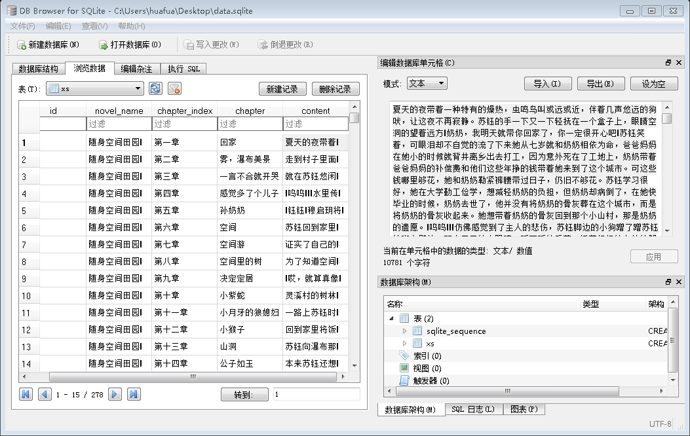

# NodeJS爬虫程序
## 1. 简介
使用`Nodejs`写的定向爬虫程序，用于从[小说吧](http://www.xs8.com)爬取小说，并将资料保存到[`sqlite`](http://www.baidu.com)数据库(`data.sqlite`)的表(`xs`)中，该表包含以字段：

    1. 小说标题(novel_name)
    2. 第几章(chapter_index)
    3. 章节标题(chapter)
    4. 章节正文(content)
## 2. 创建项目
本例中项目命名为`node_crawler`
``` shell
mkdir node_crawler
cd node_crawler
npm init -y
npm install -S sqlite3 jsdom
```
以上[jsdom](https://www.npmjs.com/package/jsdom)模块也可用[cherio](https://www.npmjs.com/package/cheerio)替换，具体用法可查看其文档

## 3. 先爬取一个章节

### 3.1 获取链接

 随便打开一个小说的页面，获取链接，如：https://www.xs8.cn/chapter/10684980704041603/28682355652566083

### 3.2 创建`app.js`,编写代码
``` javascript
const request=require("request");
const JSDOM=require("jsdom").JSDOM;
let targetUrl="https://www.xs8.cn/chapter/10684980704041603/28682355652566083";
request({
    url: targetUrl,
    methd: "get",
    headers: {
        "user-agent": "Mozilla/5.0 (Windows NT 6.1; WOW64) AppleWebKit/537.36 (KHTML, like Gecko) Chrome/47.0.2526.106 Safari/537.36"
    }
}, function (err, res, body) {
    //文本转换为DOM，便于操作
    let document=new JSDOM(body).window.document;
    //获取正文所在的div元素
    let wraper = document.querySelector("div.main-text-wrap");
    //获取小说标题
    let novel_name = document.querySelector("div.crumbs-nav a.act").innerHTML;
    //获取小说章节信息（第几章 章节标题）
    let chapter_full_name = wraper.querySelector("h3.j_chapterName").innerHTML;
    //获取正文,去除多余的<p>,</p>等内容
    let content = wraper.querySelector("div.read-content.j_readContent").innerHTML.replace(/[\<p\>\<\/p\>\s]/g, "");
    let chapter_info = chapter_full_name.split(" ");
})
```
### 3.3 本章节是否爬取
由于网站中小说是付费的，这里我们只爬取试读部分，解析DOM结构可知若结构中有`div.vip-limit-wrap`则表示该章节是收费的，不爬取，故有：
``` javascript
const request=require("request");
const JSDOM=require("jsdom").JSDOM;
request({
    url: targetUrl,
    methd: "get",
    headers: {
        "user-agent": "Mozilla/5.0 (Windows NT 6.1; WOW64) AppleWebKit/537.36 (KHTML, like Gecko) Chrome/47.0.2526.106 Safari/537.36"
    }
}, function (err, res, body) {
    //文本转换为DOM，便于操作
    let document=new JSDOM(body).window.document;
    let vipRequired = document.querySelector("div.vip-limit-wrap");
        if(!vipRequired){
        //获取正文所在的div元素
        let wraper = document.querySelector("div.main-text-wrap");
        //获取小说标题
        let novel_name = document.querySelector("div.crumbs-nav a.act").innerHTML;
        //获取小说章节信息（第几章 章节标题）
        let chapter_full_name = wraper.querySelector("h3.j_chapterName").innerHTML;
        //获取正文,去除多余的<p>,</p>等内容
        let content = wraper.querySelector("div.read-content.j_readContent").innerHTML.replace(/[\<p\>\<\/p\>\s]/g, "");           
        let chapter_info = chapter_full_name.split(" ");
    }
})
```
### 3.4 爬取下一章节
分析DOM结构，可知下一章节的链接存在于`a#j_chapterNext`元素中，因此可用如下代码获取下一章节链接：
``` javascript
let nextLink = "https:" + document.querySelector("a#j_chapterNext").getAttribute("href");
```
下一章节的爬取方式与本章一致，故封装函数：
``` javascript
//封装函数，用于递归调用
function callback(data) {
    let document = new JSDOM(data.toString()).window.document;
    let vipRequired = document.querySelector("div.vip-limit-wrap");
    if (!vipRequired) {
        let wraper = document.querySelector("div.main-text-wrap");
        let novel_name = document.querySelector("div.crumbs-nav a.act").innerHTML;
        let chapter_full_name = wraper.querySelector("h3.j_chapterName").innerHTML;
        let content = wraper.querySelector("div.read-content.j_readContent").innerHTML.replace(/[\<p\>\<\/p\>\s]/g, "");
        let nextLink = "https:" + document.querySelector("a#j_chapterNext").getAttribute("href");
        let chapter_info = chapter_full_name.split(" ");
        //第几章
        let chapter_index = chapter_info[0];
        //章节标题
        let chapter = chapter_info[1];       
    }
}
```
从而：
``` javascript
function getData(targetUrl, callback) {
    request({
        url: targetUrl,
        methd: "get",
        headers: {
            "user-agent": "Mozilla/5.0 (Windows NT 6.1; WOW64) AppleWebKit/537.36 (KHTML, like Gecko) Chrome/47.0.2526.106 Safari/537.36"
        }
    }, function (err, res, body) {
        callback && callback(body);
    })
}

//以下为调用方式
getData(targetUrl, function (data){
    callback(data);
});
```
## 4. 保存到数据库
### 4.1 选用数据库
获得数据后，需将数据持久化到数据库中，此处选用`sqlite3`数据库，
``` javascript
const sqlite = require("sqlite3");
const db = new sqlite.Database("data.sqlite");   
```
### 4.2 创建数据表
``` javascript
db.serialize(function () {
        let sql="CREATE TABLE if not exists `xs`(`id` INTEGER PRIMARY KEY AUTOINCREMENT,`novel_name` TEXT, `chapter_index` TEXT, `chapter` TEXT, `content`	TEXT)";
        db.run(sql, function () {
            console.log("table existed or created");
            getData(targetUrl, function (data) {
                callback(data);
            });
        });
    })
```
### 4.3 将数据插入到数据表中
修改callback函数，片段如下：
``` javascript
...//省略
let chapter = chapter_info[1];
db.serialize(function () {
    let insert = db.prepare("insert into xs(novel_name,chapter_index,chapter,content) values(?,?,?,?)");
    insert.run(novel_name, chapter_index, chapter, content);
    insert.finalize();
});
getData(nextLink, function (data) {
    callback(data);
})

```
## 5. 运行测试
在命令行中键入以下命令，即可完成小说试读章节的保存
`node app.js`或`npm test`

## 6. 进阶:爬取网页小说链接，并以此爬取更多小说内容
### 6.1 先尝试封装一个`getFromUrl`函数用于获取小说清单，并调用回调看是否OK,思路如下：
- 向指定地址发送一个`get`请求,当响应码为200的时候，调用回调，其他输出到控制台
- 解析网站DOM结构，获得每个小说链接(如有必要，需要拼接链接)，构成一个数组，针对每个链接调用`getSingleNovel`函数(具体看[源码](#getSingleNovel))获得该小说的第一章链接
- 将上一步获得的小说第一章链接传递到`getData`函数进行爬取


##  完整代码

爬取www.xs8.com的小说并保存到数据库的关键函数
``` javascript
const path=require("path");
// let targetUrl = "https://www.xs8.cn/chapter/10684980704041603/28682355652566083";
// targetUrl = "https://www.xs8.cn/chapter/10220792103411103/27436261890607674";
// targetUrl="https://www.xs8.cn/chapter/9673619303540603/25967671660972822";
let start_url="https://www.xs8.cn/all?pageNum=1&pageSize=1000&gender=1&catId=-1&isFinish=-1&isVip=-1&size=-1&updT=-1&orderBy=0";
const request = require("request");
const http = require("http");
const url = require("url");
const sqlite = require("sqlite3");
const db = new sqlite.Database("data.sqlite");

const JSDOM = require("jsdom").JSDOM;
const headers={
    "user-agent": "Mozilla/5.0 (Windows NT 6.1; WOW64) AppleWebKit/537.36 (KHTML, like Gecko) Chrome/47.0.2526.106 Safari/537.36"
};
```
给定小说一个章节地址，获得该章节内容
```js
function getData(targetUrl, callback) {
    request({
        url: targetUrl,
        methd: "get",
        headers: headers
    }, function (err, res, body) {
        callback && callback(body);
    })
}
```
对公共的回调进行封装
```js
function callback(data) {
    let document = new JSDOM(data.toString()).window.document;
    let vipRequired = document.querySelector("div.vip-limit-wrap");
    if (!vipRequired) {
        let wraper = document.querySelector("div.main-text-wrap");
        let novel_name = document.querySelector("div.crumbs-nav a.act").innerHTML;
        let chapter_full_name = wraper.querySelector("h3.j_chapterName").innerHTML;
        let content = wraper.querySelector("div.read-content.j_readContent").innerHTML.replace(/[\<p\>\<\/p\>\s]/g, "");
        let nextAnchor=document.querySelector("a#j_chapterNext")
        if(nextAnchor){
            let nextLink = "https:" + nextAnchor.getAttribute("href");
            let chapter_info=[];
            if(chapter_full_name.indexOf(":")!=-1){
                chapter_info = chapter_full_name.split("：");
            }else{
                chapter_info = chapter_full_name.split(" ");
            }        
            let chapter_index = chapter_info[0];
            let chapter = chapter_info[1];
            db.serialize(function () {
                let insert = db.prepare("insert into xs(novel_name,chapter_index,chapter,content) values(?,?,?,?)");
                insert.run(novel_name, chapter_index, chapter, content);
                insert.finalize();
            });
            getData(nextLink, function (data) {
                callback(data);
            })
        }
    }
}
```
从一个链接获取一定数量的小说清单，以此为突破获取小说链接
```js
function getFromUrl(all_url,callback){
    request({
        url:all_url,
        method:"get",
        headers:headers
    },function(err,res,body){
        if(!err){
            //只有状态码为200的时候进行爬取
            if(res.statusCode==200){
                let document=new JSDOM(body.toString()).window.document;
                callback&&callback(document);
            }else{
                //输出statusCode便于追踪
               console.log("you got nothing"+res.statusCode);
            }
        }else{
            //输出错误日志，便于追踪
            console.log(err);
        }
    })
}
```
运行函数的入口
```js
function start_crawler(){    
    db.serialize(function () {
        let sql="CREATE TABLE if not exists `xs`(`id` INTEGER PRIMARY KEY AUTOINCREMENT,`novel_name` TEXT, `chapter_index` TEXT, `chapter` TEXT, `content`	TEXT)";
        db.run(sql, function () {
            console.log("table existed or created");
            novelEntry(start_url);
        });
    })
}
```
<a id="getSingleNovel"></a>
获取单个小说的链接

```js
function getSingleNovel(xsurl,callback){
    request({
        url:xsurl,
        method:"get",
        headers:headers
    },function(err,res,body){
        if(!err){
            if(res.statusCode==200){
                let document=new JSDOM(body.toString()).window.document;
                callback&&callback(document);
            }else{               
                console.log("nothing to get"+res.statusCode);
            }
        }else{
            console.log(err);
        }
    });
}
```

```js
//获取小说的入口
function novelEntry(start_url){
    getFromUrl(start_url,function(data){
        let xsitems=data.querySelectorAll("div.right-book-list li");
        let urls=Array.prototype.map.call(xsitems,function(item){
            return "https://www.xs8.cn"+item.querySelector("div.book-info h3 a").getAttribute("href");
        });
        urls.forEach(function(urlItem){
            getSingleNovel(urlItem,function(data){
                let anchor=data.querySelector("a.green-btn.J-getJumpUrl");
                let targetUrl="https:"+anchor.getAttribute("href");
                getData(targetUrl, function (data) {
                    callback(data);
                });
                // console.log(targetUrl);
            });        
        })
    });
}
//开始爬取
start_crawler();
```

再次运行，应该可以将更多的数据保存到数据库中，如下图示，如遇到问题，得继续处理掉！



